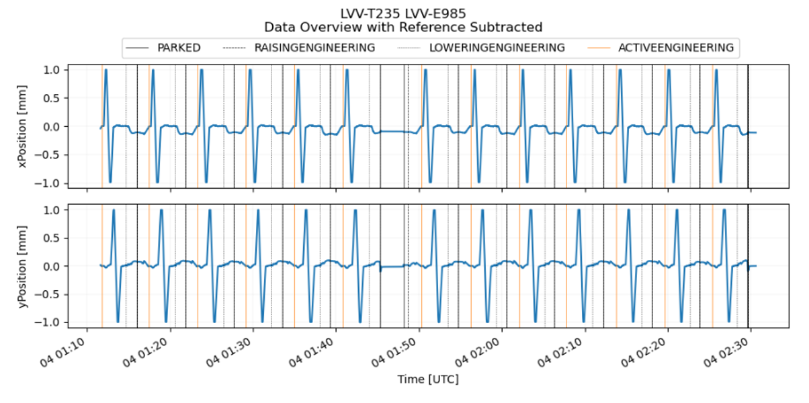
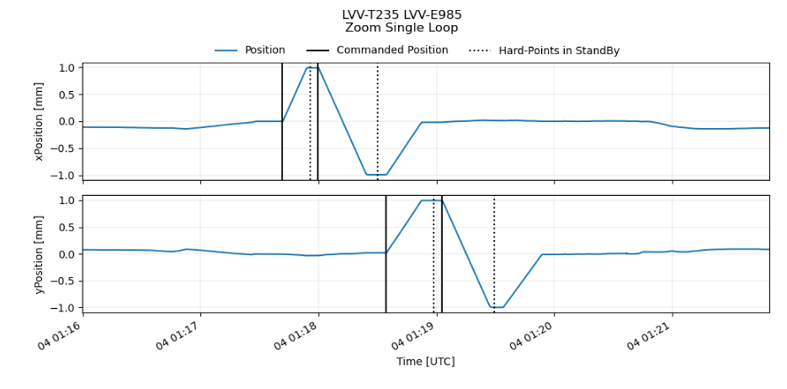
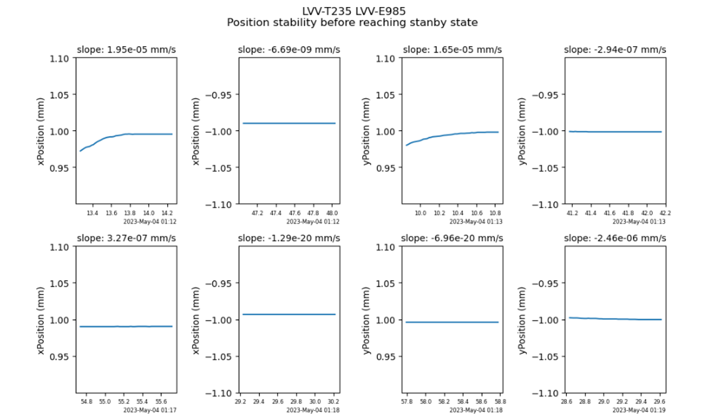

:tocdepth: 1

.. sectnum::

.. Metadata such as the title, authors, and description are set in metadata.yaml

.. TODO: Delete the note below before merging new content to the main branch.

Abstract
========

This is the technote for the Position Repeatability Analysis on the TMA with M1M3. We measured the position moved between before and after the slew. 
Analysis was done with the different elevation angles slewed at once, and also with different speed of slewing. 

Related SITCOM tickets
======================

SITCOM - 797 : M1M3 - Slewing analysis - Positioning

SITCOM - 730 : Create data analysis script/notebook for LVV-T235

SITCOM - 854 : Update LVV-T235 notebook

SITCOM - 810 : Create data analysis script/notebook for LVV-T235 - Raise/Park Repeatability

SITCOM - 797 : M1M3 - Slewing analysis - Positioning
====================================================

Analysing the positions and rotations of xzy compared between before and after the slew. Analysis done with the different elevation angles slewed. 

.. image:: images/797_position_rotation_xyz.png
  :width: 700px

Figure 1. Position moved on xyz between before and after the slew, according to the elevation slew angle

The requirement specifies that the rms repeatability of the mirror positioning is what we need. The position shouldn't be moved after slewing. 
Plot the RMS (Root Mean Square) for each of the distributions shown in the violin plot

.. image:: images/797_histogram_position_rotation_xyz.png
  :width: 700px

Figure 2. Histogram for position and rotation xyz for after - before 

SITCOM - 854 : Update LVV-T235 notebook
========================================

Assume that the systematic offset seen in each of the Rotation panels is a calibration issue, and remove the median value from each panel to assess the scatter about the median.

.. image:: images/854_rotation_sub_median.png
  :width: 700px

Figure 3. Position errors and rotation - median 

The requirement specifies that the rms repeatability of the mirror positioning is what we need. Plot the rms for each of the distributions shown in the violin plot:

.. image:: images/854_rms_repeatability.png
  :width: 700px

Figure 4. rms repeatability

SITCOM - 810 : Create data analysis script/notebook for LVV-T235 - Raise/Park Repeatability
============================================================================================
A notebook was created to fit a line to the final raised position and confirm that the slope is close to 0. The script for the test case can be found here: `M13T012 <http://lsst-ts/ts_m1m3supporttesting/M13T012.py>`__

For this analysis we are using data from the LVV-T235 test case.
The following plot shows the x and y positions (shifted in order to be centered around 0) as a function of time, the vertical lines shows the various M1M3 "detailedStates". We see that the same pattern is repeated several times over the chosen data taking period.

If we isolate one of the patterns we get the following where the lines show the Hard Point states

We are interested in the slope of the x and y positions on the flat tops / bottoms just before reaching the "Hard Point in Standby" status. We choose to select and analyze one second of data before "HP in standby".
We repeat this selection for every cycle in x and y and get a set of plots like the following showing the x and y positions as a function of time in the one-second time windows

The slope measurement is performed on every subset of data. Statistics are summarized in the following table

.. image:: images/810_slope_plot.png
  :width: 700px

Figure 5. x position between successive ACTIVEENGINEERING and LOWERINGENGINEERING states, and between selected timestamps where all 6 Hard Points are in standby `(motionState == 0)`. 

.. image:: images/810_table_slopes.png
  :width: 700px
 
Figure 6. Statistics on slopes in `mm/s`

We conclude that on this dataset, the slopes of x and y positions as a function of time are all compatible with 0 

Reference links
=================
<http://lsst-ts/ts_m1m3supporttesting/M13T012.py>

.. See the `reStructuredText Style Guide <https://developer.lsst.io/restructuredtext/style.html>`__ to learn how to create sections, links, images, tables, equations, and more.

.. Make in-text citations with: :cite:`bibkey`.
.. Uncomment to use citations
.. .. rubric:: References
.. 
.. .. bibliography:: local.bib lsstbib/books.bib lsstbib/lsst.bib lsstbib/lsst-dm.bib lsstbib/refs.bib lsstbib/refs_ads.bib
..    :style: lsst_aa

Acronyms
=========
IMS (Independent measuring system)

RMS (Root Mean Square)