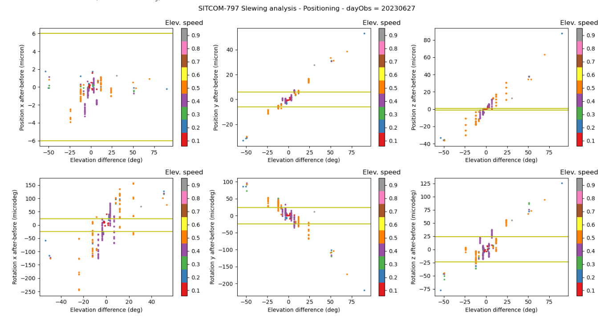
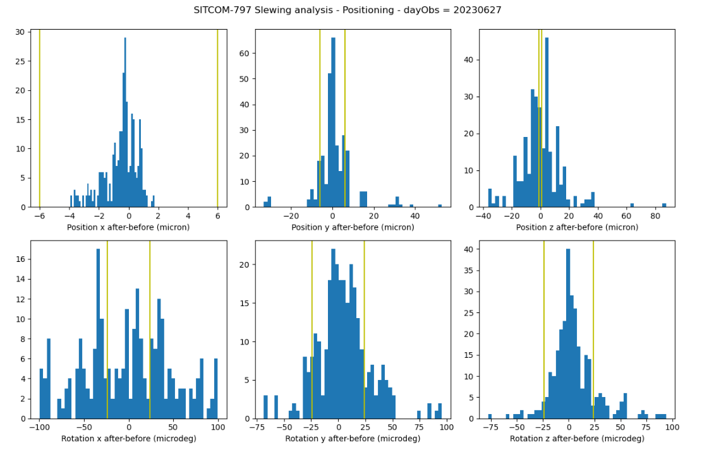
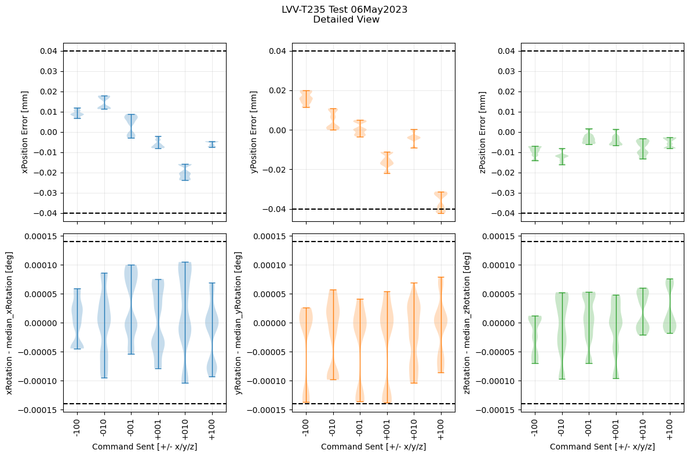
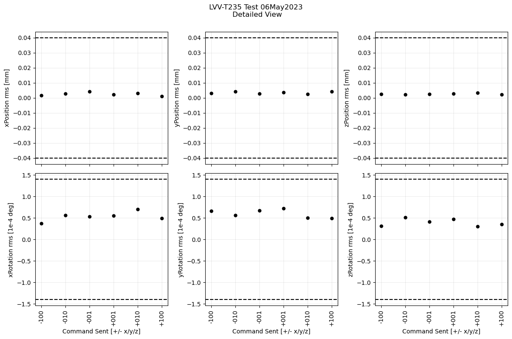
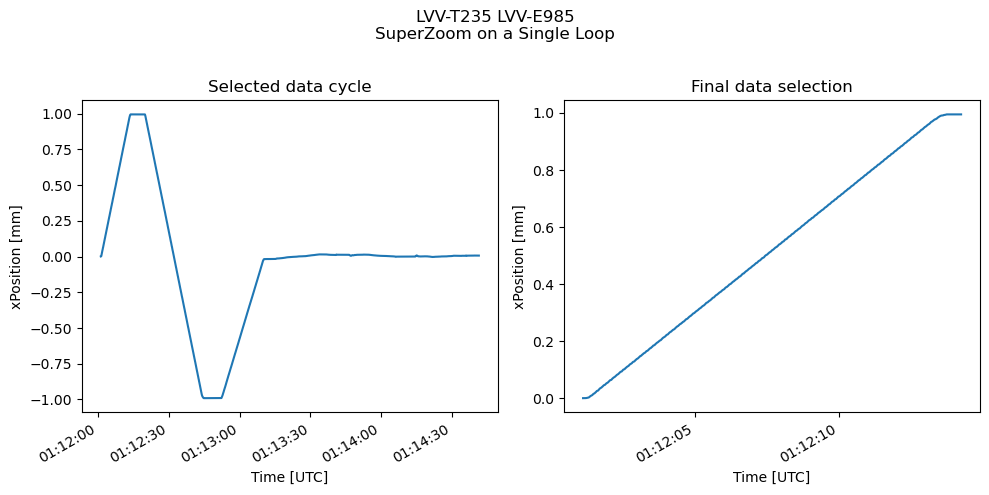
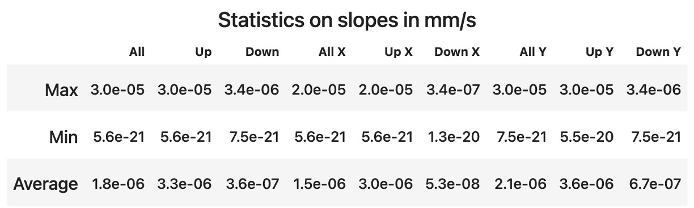

:tocdepth: 1

.. sectnum::

.. Metadata such as the title, authors, and description are set in metadata.yaml

.. TODO: Delete the note below before merging new content to the main branch.

.. note::

   **This technote is a work-in-progress.**

Abstract
========

This is the technote for the Position Repeatability Analysis on the TMA with M1M3 

Related SITCOM tickets
======================

SITCOM - 797 : M1M3 - Slewing analysis - Positioning

SITCOM - 730 : Create data analysis script/notebook for LVV-T235

SITCOM - 854 : Update LVV-T235 notebook

SITCOM - 810 : Create data analysis script/notebook for LVV-T235 - Raise/Park Repeatability

SITCOM - 797 : M1M3 - Slewing analysis - Positioning
====================================================

Analysing the positions and rotations of xzy compared between before and after the slew. Analysis done with the different elevation angles slewed. 

Figure 1. Position moved on xyz between before and after the slew, according to the elevation slew angle

The requirement specifies that the rms repeatability of the mirror positioning is what we need. Plot the rms for each of the distributions shown in the violin plot:

Figure 2. Histogram for position and rotation xyz for after - before 

SITCOM - 854 : Update LVV-T235 notebook
========================================

Assume that the systematic offset seen in each of the Rotation panels is a calibration issue, and remove the median value from each panel to assess the scatter about the median.

Figure 3. Position errors and rotation - median 

The requirement specifies that the rms repeatability of the mirror positioning is what we need. Plot the rms for each of the distributions shown in the violin plot:

Figure 4. rms repeatability

SITCOM - 810 : Create data analysis script/notebook for LVV-T235 - Raise/Park Repeatability
============================================================================================
Notebook to fit a line to the final raised position and confirm that the slope is close to 0. The script for the test case can be found here: `http://lsst-ts/ts_m1m3supporttesting/M13T012.py`

Figure 5. x position between successive ACTIVEENGINEERING and LOWERINGENGINEERING states, and between selected timestamps where all 6 Hard Points are in standby (motionState == 0). 

 
Figure 6. Statistics on slopes in mm/s
.. See the `reStructuredText Style Guide <https://developer.lsst.io/restructuredtext/style.html>`__ to learn how to create sections, links, images, tables, equations, and more.

.. Make in-text citations with: :cite:`bibkey`.
.. Uncomment to use citations
.. .. rubric:: References
.. 
.. .. bibliography:: local.bib lsstbib/books.bib lsstbib/lsst.bib lsstbib/lsst-dm.bib lsstbib/refs.bib lsstbib/refs_ads.bib
..    :style: lsst_aa
