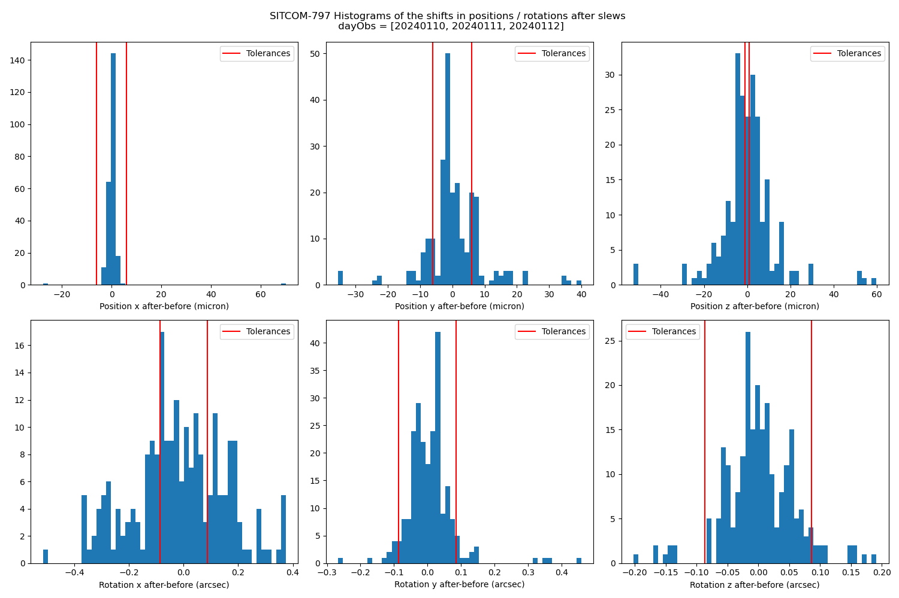
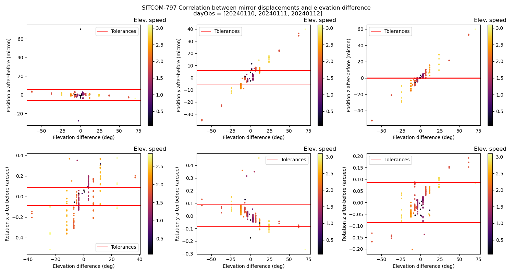
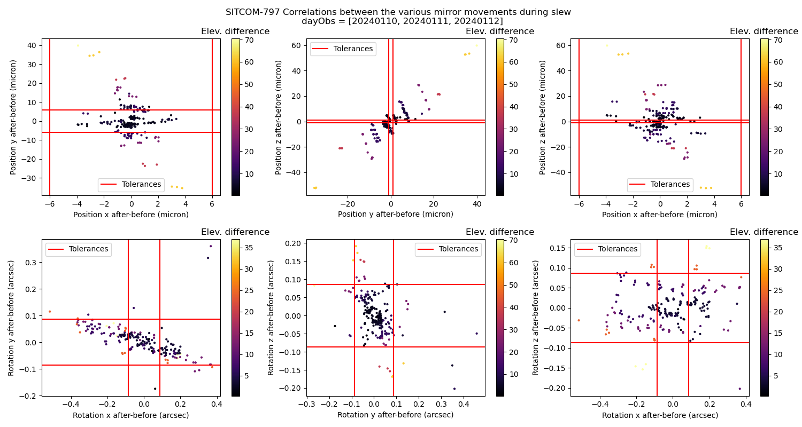
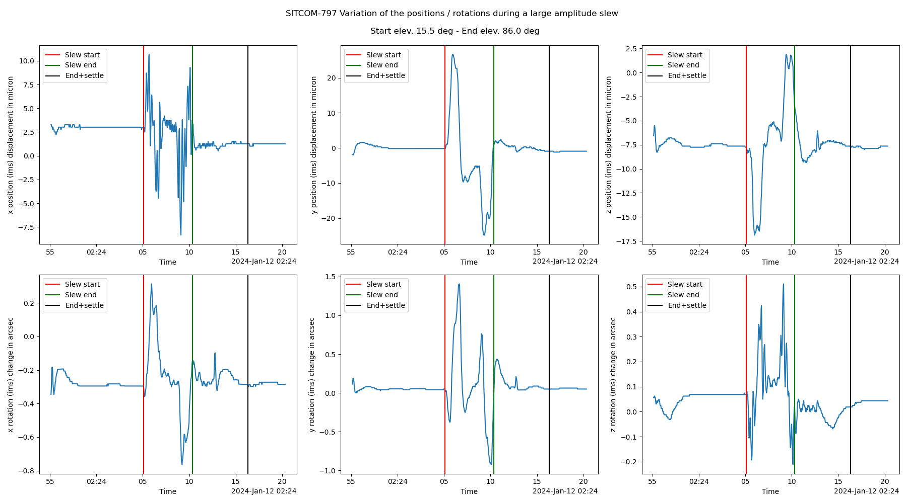
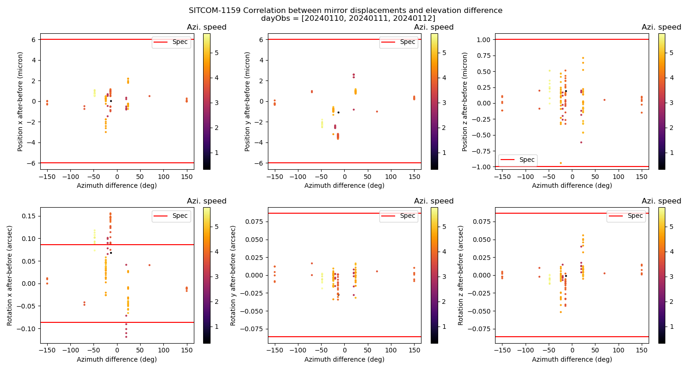
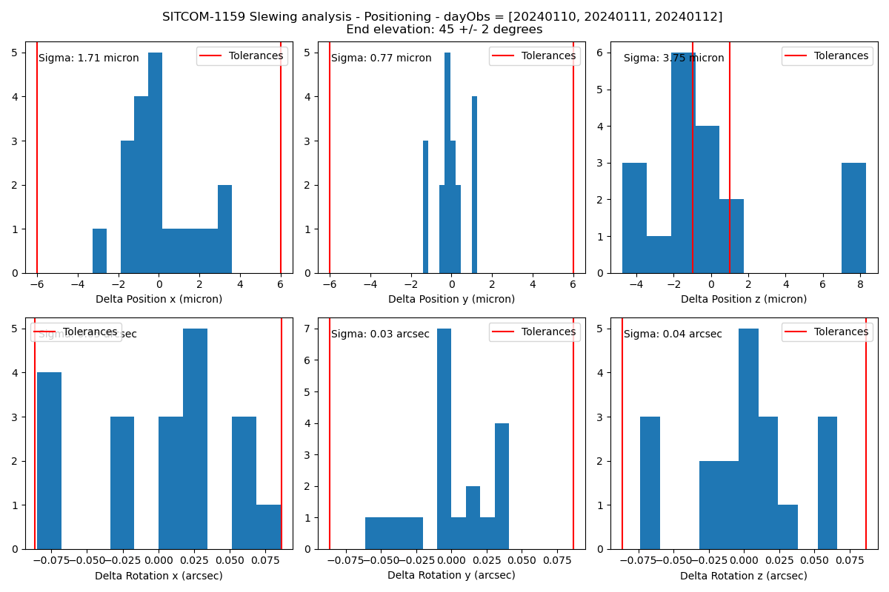
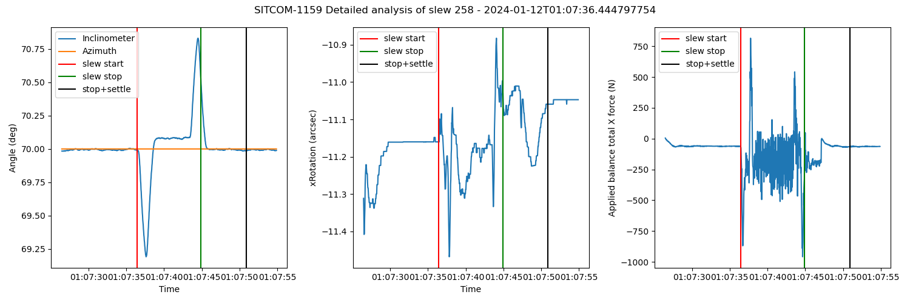

.. Tickets
.. _sitcom-797: https://jira.lsstcorp.org/browse/SITCOM-797
.. _sitcom-730: https://jira.lsstcorp.org/browse/SITCOM-730
.. _sitcom-854: https://jira.lsstcorp.org/browse/SITCOM-854
.. _sitcom-810: https://jira.lsstcorp.org/browse/SITCOM-810
.. _sitcom-1118: https://jira.lsstcorp.org/browse/SITCOM-1118

.. Requirements
.. _LTS-88: https://ls.st/LTS-88

.. Notebooks
.. _SITCOM-797_ims_slewing_analysis_positioning: https://github.com/lsst-sitcom/notebooks_vandv/blob/develop/notebooks/tel_and_site/subsys_req_ver/m1m3/SITCOM-797_ims_slewing_analysis_positioning.ipynb
.. _SITCOMN-084--ims_slewing_azimuth_analysis_positioning: https://github.com/lsst-sitcom/notebooks_vandv/blob/develop/notebooks/tel_and_site/subsys_req_ver/m1m3/SITCOMTN-084-ims_slewing_azimuth_analysis_positioning.ipynb
.. _SITCOM-797_MTM1M3_Position_Stability_17Nov23: https://github.com/lsst-sitcom/notebooks_vandv/blob/develop/notebooks/tel_and_site/subsys_req_ver/m1m3/SITCOM-797_MTM1M3_Position_Stability_17Nov23.ipynb
.. _LVV-T235-analysis: https://github.com/lsst-sitcom/notebooks_vandv/blob/develop/notebooks/tel_and_site/subsys_req_ver/m1m3/LVV-T235-analysis.ipynb
.. _LVV-T235-SITCOM-810: https://github.com/lsst-sitcom/notebooks_vandv/blob/develop/notebooks/tel_and_site/subsys_req_ver/m1m3/LVV-T235-SITCOM-810.ipynb

.. Telemetry
.. _MTMount.azimuth: https://ts-xml.lsst.io/sal_interfaces/MTMount.html#azimuth
.. _MTMount.elevation: https://ts-xml.lsst.io/sal_interfaces/MTMount.html#elevation
.. _MTM1M3.hardpointActuatorData: https://ts-xml.lsst.io/sal_interfaces/MTM1M3.html#hardpointactuatordata
.. _MTM1M3.hardpointMonitorData: https://ts-xml.lsst.io/sal_interfaces/MTM1M3.html#hardpointmonitordata
.. _MTM1M3TS.glycolLoopTemperature: https://ts-xml.lsst.io/sal_interfaces/MTM1M3TS.html#glycollooptemperature
.. _MTM1M3.imsData: https://ts-xml.lsst.io/sal_interfaces/MTM1M3.html#imsdata

###############################
Position Repeatability Analysis
###############################

.. abstract::

   This is the technote for the Position Repeatability Analysis on the TMA with M1M3.
   We measured the mirror motion (position and rotation) before and after a slew.
   Analysis was done for slews reaching different elevation angles, and also for different slewing speeds.

.. TODO: Delete the note below before merging new content to the main branch.

Requirements verified
=====================

For all the tests, the requirements are extracted from the following document:

* `LTS-88`_ M1M3 Mirror Support Design Requirements Document

**LTS-88-REQ-0052**: The positioning system SHALL maintain mirror decenter less than **+/- 6
micrometer**, mirror tilt less than **+/-24 e-6 degree**, and piston less than **+/- 1 micrometer**, all
relative to the mirror cell, after a slew of 3.5 degrees or less (**short slew**).

**LTS-88-REQ-0053**: : The positioning system SHALL maintain mirror decenter less than **+/- 17
micrometer**, mirror tilt less than **+/- 71e-6 degrees**, and piston less than **+/- 5 micrometer**, all
relative to the mirror cell, after a slew greater than 3.5 degrees (**long slew**).

**LTS-88-REQ-0054**: The repeatability of positioning the mirror from operation to parking and back
to operation SHALL be better than **+/- 40 micrometer of decenter** for the X and Y axis, and
better than **+/- 1.4 e-4 degree of tilt** around X and Y axis.

Related SITCOM tickets
======================

`SITCOM-797`_:  Slewing analysis - Positioning

`SITCOM-730`_:  Create data analysis script/notebook for LVV-T235 - Positioning

`SITCOM-854`_:  Update LVV-T235 notebook

`SITCOM-810`_: Create data analysis script/notebook for LVV-T235 - Raise/Park Repeatability

`SITCOM-1118`_: M1M3 slewing analysis when TMA moves in azimuth only

`SITCOM-1159`_: M1M3 - Take TMA settle time into account when analyzing mirror position repeatability

Telemetry
=========

In this technote we analyze the telescope mount telemetry (mtmount)
to gather the information about the telescope motion. The relevant telemetry are:

  - `MTMount.azimuth`_
  - `MTMount.elevation`_

We are also interested on the position of the M1M3 mirror measured by the IMS

  - `MTM1M3.imsData`_

And the temperature of the glycol loop inside the mirror cell.

  - `MTM1M3TS.glycolLoopTemperature`_

Slewing analysis - Positioning
============================================

Associated ticket: `SITCOM-797`_, `SITCOM-1159`_.

Related notebook:
`SITCOMTN-084-ims_slewing_elevation_analysis_positioning`_.

For this analysis, we compare the positions and rotations reported by the IMS before and after a slew. The analysis is done using different elevation and azimuth angles and speed. The measurement of the mirror positions / rotations before the slew is performed by averaging the positions / rotations reported by the IMS over a 2 second time window right before the slew. The measurement of the mirror positions / rotations after the slew is performed by averaging the positions / rotations reported by the IMS over a 2 second time window computed after a 6 second settle time after the end of the slew.

In order to benefit from the latest tuning of the M1M3 + TMA system, we have selected data acquired during the last 3 days of operation before the january 2024 shutdown (when the cell + surrogate mirror were removed). Slews are selected using the TMAEventMaker utility and slews with no blockInfos are rejected. This allows to avoid spurious data.

Requirements are specified in **LTS-88-REQ-0052**.

Figure 1. Histogram of position and rotation difference after - before slew.
The red lines indicate the tolerance intervals

Figure 2. x, y, z position and rotation shifts as a function of the elevation angle difference.
The color scale shows the elevation speed and the red lines indicate the tolerance intervals.

Figure 3. Correlations between the position / rotation shifts in x, y, z. The color scale shows the elevation angle difference during the slew and the red lines indicate the tolerance intervals.

Figure 4. Mirror positions and rotations as a function of time as reported by the IMS during a large (70.5 degrees) elevation slew. The vertical red lines show the start of the slew, the green ones show the end of the slew and the rightmost black ones correspond to the end of the slew plus a 6s settle time. 

From these plots we conclude that the initial specifications on the mirror positions and rotations are not met, especially for the piston (z displacement). After discussion with experts, it was realized that these displacements are normal and correspond to the sag of the mirror cell due to gravity change that should be compensated by adjusting the M2 and camera hexapods. 

Slewing in Azimuth Analysis - Positioning
=========================================

Associated ticket: `SITCOM-1118`_, `SITCOM-1159`_.

Related notebook:
`SITCOMN-084-ims_slewing_azimuth_analysis_positioning`_.

This analysis is very similar to the one described in the previous section but this time we select slews where the TMA is moving in **azimuth only**. In this case we do not expect significant forces to be applied to the M1M3 mirror cell. In the same way as before we allow a 6s settle time before measuring the final mirror positions and rotations.

.. figure:: _static/TN084-azi-histo.png
  :width: 700px

Figure 5. Histograms of the x, y, z position and rotation displacements. The red lines show the targeted tolerances

Figure 6. x, y, z position and rotation displacements as a function of the azimuth angle difference. The color scale shows the speed in azimuth and the red lines indicate the tolerance intervals.

In this analysis we see that the mirror displacements are within the specifications but for the rotation around the x axis where there are some outliers. The mirror rotation seems also correlated to the azimuth difference for movement < 50 degrees. For larger TMA movements the mirror rotation is within the specifications. This behavior needs to be confirmed on a larger statistics.

Compensating Mirror Motion with the Hexapods
============================================

Associated ticket: `SITCOM-797`_.

Related notebook: `SITCOM-797_MTM1M3_Position_Stability_17Nov23`_.

In previous analysis, we identified a depency of the mirror position and the elevation because
of gravity effects.
The strategy to compensate the mirror cell displacement by adjusting the M2
and camera hexapods requires that the mirror motion be reproducible,
so that a look-up table for the hexapods will be able to follow the motion to
the specified tolerances.

In this analysis, we aim to **examine the reproducibility of the mirror motion as a function of
elevation angle and slew speed**.
So the next step was to look at a large number of slews
taken during a random walk session and look at the mirror position as a function of
elevation for each of the slews.

This is shown in Figure 7.  The colors are the slew speed as a percentage of maximum speed.
The curves seem to group themselves according to the slew speeds.
However, note the speed grouping is ordered as 30-40-50-20, which is the order that the tests were run in.
So it is more likely that the grouping reflects something else varying during the night.
One possibility is that the variation is caused by temperature.

Figure 8 shows the Z-position variation through the same group of slews.
Even though the temperature change during the run was only 0.6C, compensating for
temperature significantly reduces the scatter in the points. However, note that
we are still a factor of 3-5 away from meeting the specification.

More testing is needed to see if we can reduce the scatter to the required level.

.. figure:: _static/Final_Mirror_Position_AzLimits_3_03Aug23.png
  :width: 700px

Figure 7. Mirror position as reported by the IMS at the end of many slews during a random walk session.
Detailed explanation in the text.

.. figure:: _static/Mirror_Position_Temperature_03Aug23.png
  :width: 700px

Figure 8. Mirror Z-position as reported by the IMS at the end of many slews during a random walk session.
The temperature during the night is shown in the lower left.
Compensating for temperature significantly reduces the scatter in the points,
but we are still a factor of 3-5 away from meeting the specification.

Position and Rotation Repeatibility for a Specific Target Elevation.
====================================================================

Associated ticket: `SITCOM-797`_.

Related notebook:
`SITCOMTN-084-ims_slewing_elevation_analysis_positioning`_.

In this analysis we select large amplitude slews (elevation difference > 10 degrees) where the target elevation is 45 +/- 2 degrees and we check the posision / rotation shift with respect to the average position / rotation for this specific elevation angle. We find only 19 slews with such characteristics but despite of the limited statistics it seems that the position / rotation shifts are closer to the specifications with respect to the case where the target elevation is not fixed to a specific value. This study would have to be repeated with a larger statistics to draw firm conclusions.

Figure 9. Mirror position / rotation shifts for target elevation equal to 45 +/- degrees. Detailed explanation in the text.

Detailed analysis of a slew where the TMA is moving in azimuth only
===================================================================

Associated ticket: `SITCOM-797`_.

Figure 10. Variation as a funtion of time of the inclinometer and azimuth measurement (left), the rotation around the x axis (middle) and the total applied balance force along the x axis (right) for a single slew. 

The azimuth measurement is flat all along the slew but we know that a time delay makes this measurement unreliable. The inclinometer measurement is supposed to give the angle of rotation of the mirror around the x axis but it is also sensitive to the acceleration of the TMA. This effect is clearly seen in the left panel of the previous figure. As the inclinometer data is part of the mirror position control loop, the system is probably over-compensating the mirror rotation around the x axis, leading to mirror displacements out of specification. A possible way to overcome this problem would be to fit the inclinometer values to the measured applied forces in order to be able to subtract the effect of the acceleration from the inclinometer data. This will be attempted in a separate analysis.

Position Repeatability After Parking.
=====================================

Associated ticket: `SITCOM-854`_.

Related notebook:
`LVV-T235-analysis`_.

Assume that the systematic offset seen in each of the Rotation panels is a calibration issue, and remove the median value from each panel to assess the scatter about the median.

.. figure:: _static/854_rotation_sub_median.png
  :width: 700px

Figure 11. Position errors and rotation - median

The requirement specifies that the rms repeatability of the mirror positioning is what we need. Plot the rms for each of the distributions shown in the violin plot:

Figure 12. rms repeatability

Raise/Park Repeatability
========================

Associated ticket: `SITCOM-810`_.

Related notebook: `LVV-T235-SITCOM-810`_.

In this analysis we use the data from the LVV-T235 test case where the mirror cell is repeatedly lowered and raised. We fit a line to the final raised position as measured by the IMS in order to verify that the slope is compatible with 0 mening that the mirror cell has reached a stable position and is not moving anymore.

The following plot shows the x and y positions (shifted in order to be centered around 0) as a function of time, the vertical lines indicate the various M1M3 "detailedStates". We see that the same pattern is repeated several times over the chosen data taking period.

.. figure:: _static/810_overview_ref_subtracted.png
  :width: 700px

Figure 13. x and y positions while lowering and raising the mirror

If we isolate one of the patterns we get the following figure where the lines show the Hard Point states

Figure 14. Zoom on a single lowering / raising cycle

We are interested in the slope of the x and y positions on the flat tops / bottoms just before reaching the state: "HP in Standby" (indicated by the dotted lines). We choose to select and analyze one second of data before "HP in standby". During this last second the position is expected to be stable, showing a slope which is compatible with 0.

We repeat this selection for every cycle in x and y and get a set of plots like the following showing the x and y positions as a function of time in the one-second time windows.

.. figure:: _static/810_position_stability.png
  :width: 700px

Figure 15. x and y positions during the last second before reaching the "standby" state for typical cycles

The slope measurement is performed on every subset of data. Statistics are summarized in the following table

We conclude that on this dataset, the slopes of x and y positions as a function of time are all compatible with 0.

Reference links
=================
<http://lsst-ts/ts_m1m3supporttesting/M13T012.py>

.. See the `reStructuredText Style Guide <https://developer.lsst.io/restructuredtext/style.html>`__ to learn how to create sections, links, images, tables, equations, and more.

.. Make in-text citations with: :cite:`bibkey`.
.. Uncomment to use citations
.. .. rubric:: References
..
.. .. bibliography:: local.bib lsstbib/books.bib lsstbib/lsst.bib lsstbib/lsst-dm.bib lsstbib/refs.bib lsstbib/refs_ads.bib
..    :style: lsst_aa

Acronyms
=========
IMS (Independent measuring system)

HP (Hard Point)

RMS (Root Mean Square)

TMA (Telescope Mount Assembly)